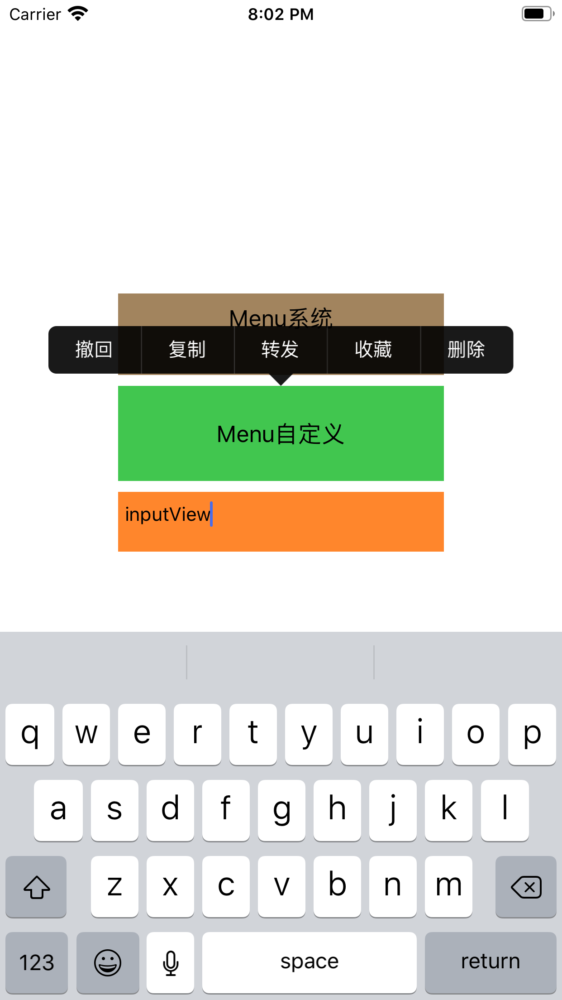

# MenuDemo

#### 主要根据参考[KLPopMenu](https://github.com/kouliang/KLPopMenu)，更新改变而成的长按菜单选项控件，为更有效模拟系统的效果，有细微调整

## 情况一：完全系统效果

#### 1、系统的菜单选项

##### 长按输入框后的效果：

## 情况二：自定义效果

#### 2、自定义的菜单选项（可以模拟微信的聊天界面）

##### 长按输入框后的效果：
